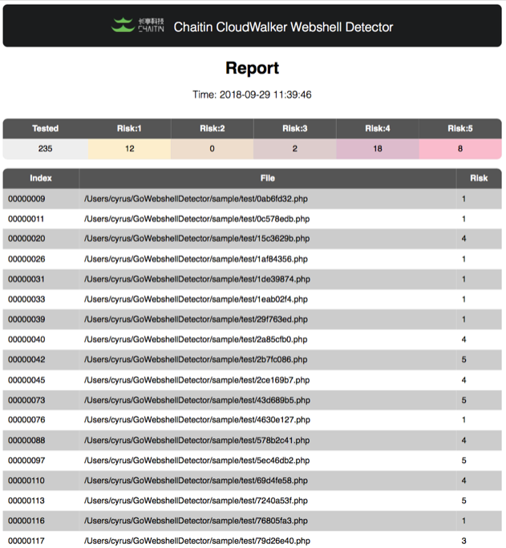

**本项目停止更新，感谢一直以来的支持。**

**长亭科技已发布[牧云企业版](https://www.chaitin.cn/zh/cloudwalker)，敬请关注。**

**牧云企业版的全新 webshell 检测能力可以在 [Xray 社区](https://stack.chaitin.com/security-challenge/webshell/index) 体验，批量检测 API 可以通过[百川云平台](https://rivers.chaitin.cn/) 接入。**

# CloudWalker（牧云）开源计划

CloudWalker（牧云）是长亭推出的一款开源服务器安全管理平台。根据项目计划会逐步覆盖服务器资产管理、威胁扫描、Webshell 查杀、基线检测等各项功能。

本次开源作为开源计划的第一步，仅包含 Webshell 检测引擎部分，重点调优 Webshell 检测效果。目前放出的是一个可执行的命令行版本 Webshell 检测工具。

# 下载地址

工具打包形式为单个可执行文件，下载之后添加可执行权限即可执行。

[Release 页面](https://github.com/chaitin/cloudwalker/releases)

# 使用方式

```
$ ./webshell-detector /path/to/your-web-root/ /var/www/html /path/to/some-file
```


## 输出 HTML 报告

```
$ ./webshell-detector -html -output result.html /path/to/web-root/
```

输出报告样例如下：



## 输出结果描述

目前检测结果分为 5 个级别，级别越高说明检测出 Webshell 的可能性越高，如果没有级别说明不存在 Webshell 风险。

## 线上测试 Demo 地址

线上测试 Demo 地址：https://webshellchop.chaitin.cn/ 

（注意：线上 Demo 代码检测效果可能有微弱差异）

## 支持系统与版本

 - 主流 Linux 发行版（内核不能太老，至少 2.6.32，否则会由于 Go 语言不支持直接打印 FATAL: kernel too old）
 - MacOS 可自行编译
 - Windows 暂不支持

# Roadmap and TODO List

 - 整理完成产品框架代码并开源
 - 实现统一插件管理与通信机制
 - 提供插件 SDK 
 - 文档、Demo 等

# License

[GPLv3](LICENSE)

